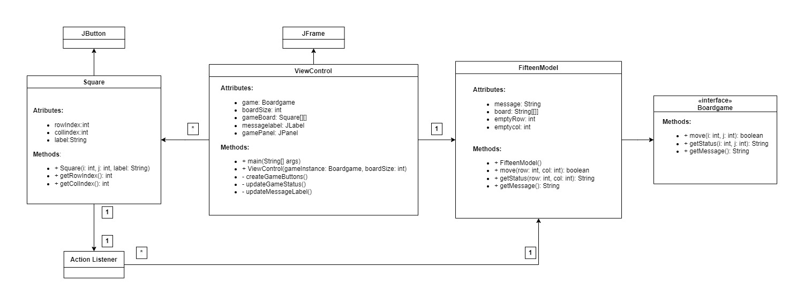
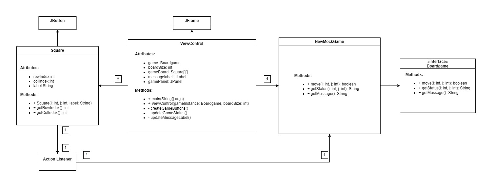
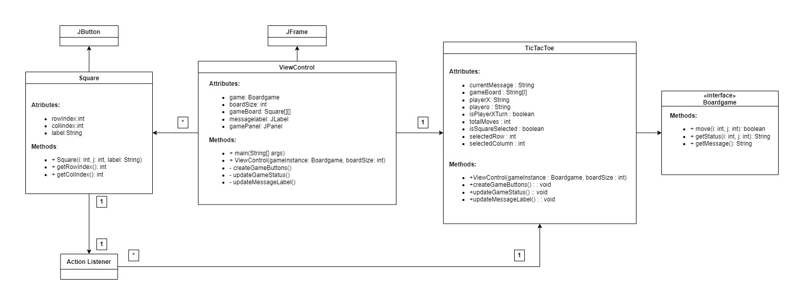

# Java Game Collection

Welcome to the Java Game Collection project! This repository contains a collection of simple Java games with graphical user interfaces (GUI) implemented using Swing. Each game is organized into its respective folder, and this general README will provide an overview of the project's goals and structure.

## Project Overview

The goal of this project is to showcase simple Java game implementations and provide a foundation for learning and building upon these games. Each game is designed to demonstrate different concepts related to Java programming, GUI development, and game logic.

## Game List

The project includes the following games:

### Fifteen Game

The "Fifteen Game" folder contains a simple implementation of the Fifteen Puzzle game, also known as the 15-puzzle or Gem Puzzle. The game board consists of a grid of numbered tiles, and the goal is to arrange the tiles in ascending order.

- **Folder:** `FifteenGame`
- **Game Class:** `FifteenModel`
- **GUI Class:** `ViewControl`

---

### Mock Game

The "Mock Game" folder contains a mock game implementation with a graphical user interface (GUI). The game demonstrates basic interactions and messaging between players.

- **Folder:** `MockGame`
- **Game Class:** `NewMockGame`
- **GUI Class:** `ViewControl`

---

### Tic-Tac-Toe Game

The "Tic-Tac-Toe Game" folder contains a simple implementation of the classic Tic-Tac-Toe (X and O) game. Two players take turns marking squares on a 3x3 grid to form a line of their symbols.

- **Folder:** `TicTacToe`
- **Game Class:** `TicTacToe`
- **GUI Class:** `ViewControl`

## Usage

To explore and run each game, navigate to the respective folder and follow the instructions provided in the specific README file for that game. You can compile and execute the Java classes to run the games and interact with them via the GUI.

Feel free to use and modify the code for educational purposes, experiment with game development concepts, or simply enjoy playing these classic games.

---
