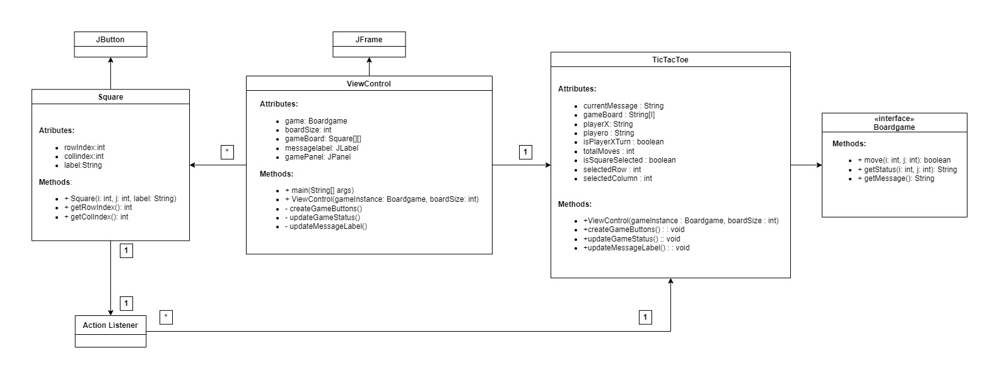

# Tic-Tac-Toe Game

This Java code represents a simple implementation of the Tic-Tac-Toe (X and O) game. The code is organized into several classes:

1. **Boardgame Interface (`Boardgame.java`)**: Defines the contract for a board game with move functionality and status tracking.

2. **Square Class (`Square.java`)**: Represents individual squares (buttons) on the Tic-Tac-Toe game board with graphical properties.

3. **TicTacToe Class (`TicTacToe.java`)**: Implements the `Boardgame` interface and provides the core logic for the Tic-Tac-Toe game.

4. **ViewControl Class (`ViewControl.java`)**: Handles the graphical user interface (GUI) for the game using Swing, including creating the game board and updating the game's status and messages.

## Tic-Tac-Toe Game

### Description

Tic-Tac-Toe is a classic two-player game where players take turns marking X or O in a 3x3 grid. The objective is to form a horizontal, vertical, or diagonal line of three of their symbols.

### Usage

1. Compile and run the `ViewControl` class to start the Tic-Tac-Toe game GUI.
2. The game board consists of a 3x3 grid of squares (buttons).
3. Players take turns clicking on an empty square to place their X or O.
4. The game tracks the status of each square and displays messages for the players.
5. The game ends when one player wins or the board is full (a draw).

## Class Overview

- `Boardgame` Interface: Defines methods for moving, getting status, and getting messages.
- `Square` Class: Represents graphical squares/buttons on the Tic-Tac-Toe game board.
- `TicTacToe` Class: Implements the game logic for Tic-Tac-Toe, including moves, win conditions, and messages.
- `ViewControl` Class: Manages the GUI and user interactions for the Tic-Tac-Toe game.

---

